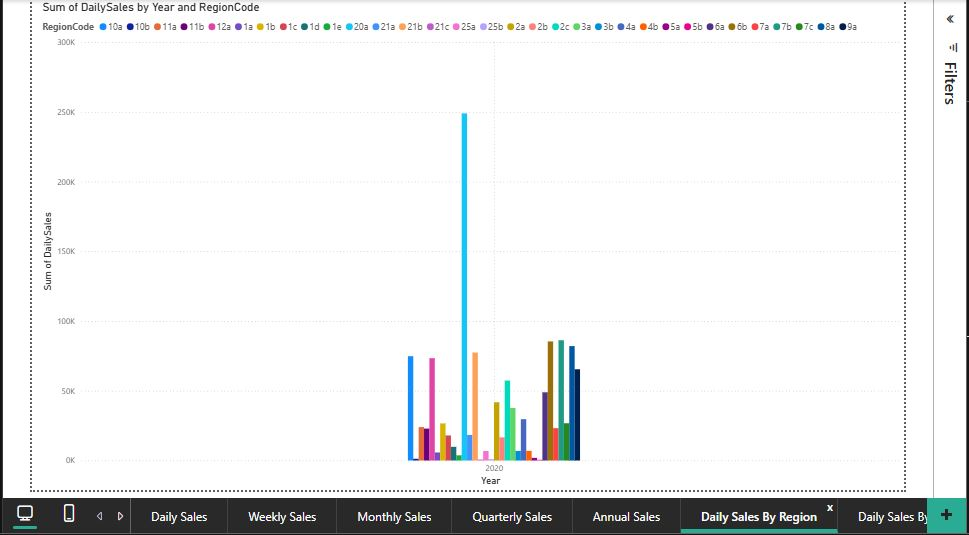
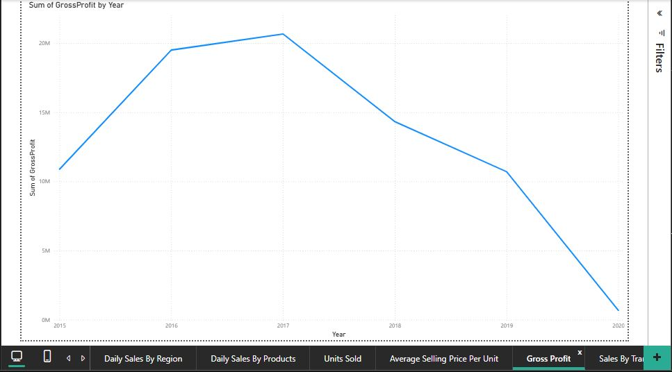
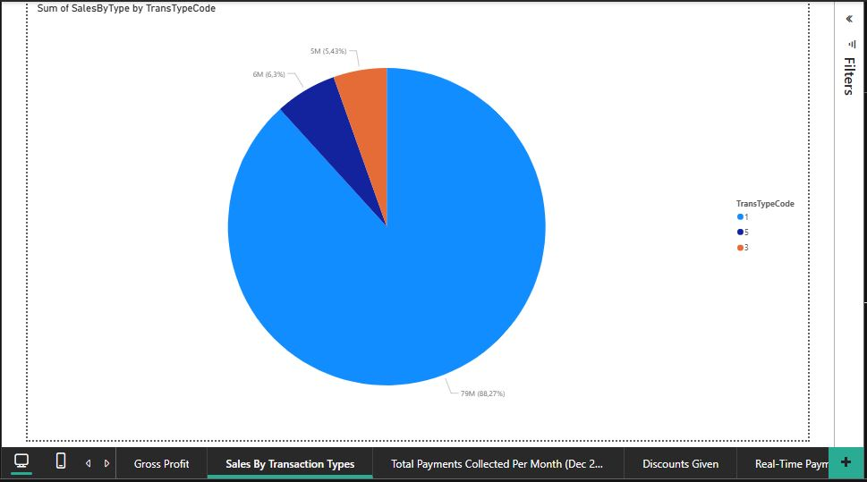
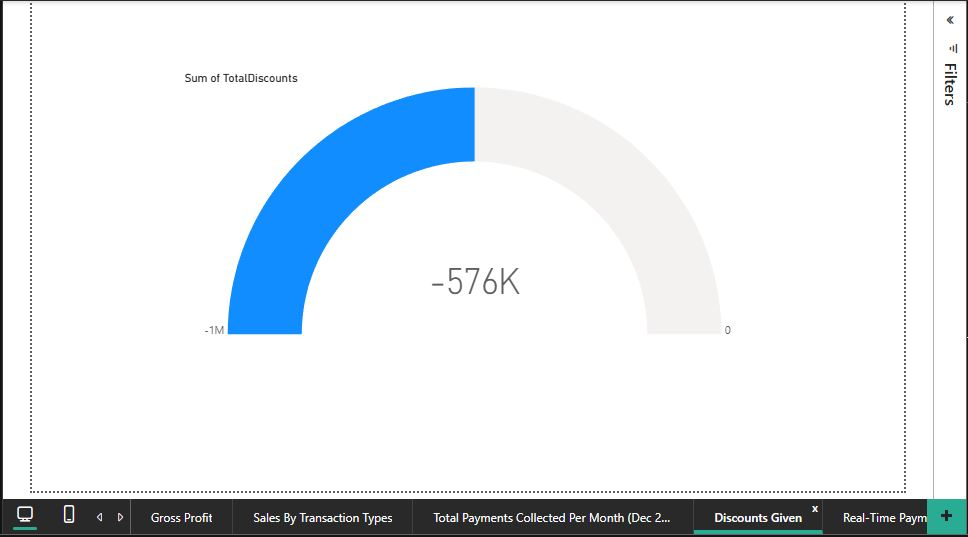
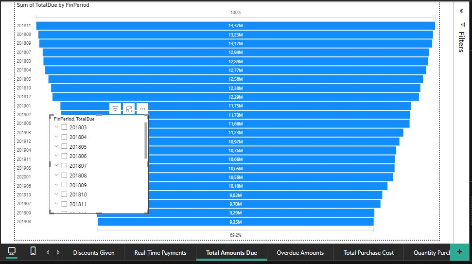
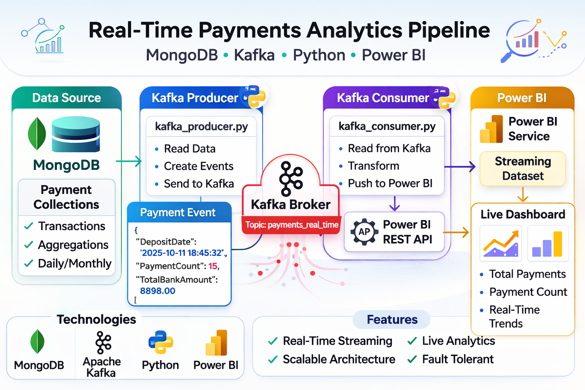

<!--
   🎯 Professional README for the Clearvue Real-Time Payments Project
-->

  <h1>📊 Clearvue Real-Time Payments Analytics</h1>
  
A real-time financial streaming pipeline using Kafka, MongoDB, Python, and Power BI

<!-- Badges -->

  
  
  
  

---

## 🚀 Project Overview

This repository contains a **fully functional real-time analytics pipeline** that streams payment events from a database through Kafka into Power BI dashboards.  
As events are produced, visualizations update *in real-time* — ideal for monitoring finance operations, sales flows, or live business KPIs.

---

## 🧠 Architecture

Below is a simplified architecture diagram of how the components interact:

MongoDB ──(aggregations)──▶ Kafka Producer ──▶ Kafka Broker ──▶ Kafka Consumer ──▶ Power BI

> Payments are aggregated and streamed using Kafka. The consumer pushes data into a Power BI streaming dataset for live dashboards.

---

## 🛠 Features

✔ Real-time streaming pipeline  
✔ Live dashboards in Power BI  
✔ Clean Python producer & consumer  
✔ Aggregation logic included for finance metrics  
✔ Easily deployable and extensible

---

## 📁 Project Structure

├── kafka_producer.py # Sends payment events to Kafka

├── kafka_consumer.py # Consumes payment events and pushes to Power BI

├── mongodb_aggregations.js # MongoDB query pipelines

├── requirements.txt # Python dependencies

├── README.md # Project documentation

└── screenshots/ # Dashboard & architecture images

---

## 📷 Screenshots

### Dashboard Overview

### Architecture Diagram

---

## 🧱 Setup Instructions

### 1. Install dependencies
pip install -r requirements.txt

### 2. Start Kafka broker (KRaft mode)
kafka-server-start.bat config/kraft/server.properties

### 3. Create Kafka topic
kafka-topics.bat --create --topic payments_real_time --bootstrap-server localhost:9092

### 4. Run Python producer & consumer
python kafka_producer.py
python kafka_consumer.py

### 5. View Power BI live dashboard
Follow the streaming dataset in Power BI Service to connect visuals.

## 📌 Use Cases

✔ Real-time financial reporting

✔ Live sales dashboards

✔ Streaming operational monitoring

✔ Prototypes for business intelligence

## 📫 Contact

Laura Bailie •

📍 Cape Town, South Africa

💼 LinkedIn: https://www.linkedin.com/in/laura-bailie-2167b820b/ 

✉️ Email: laurabailie11@gmail.com 